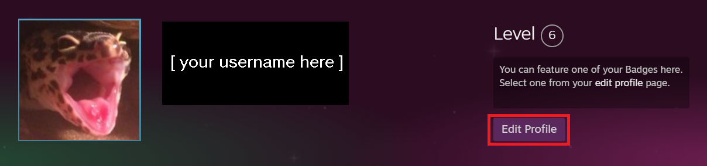
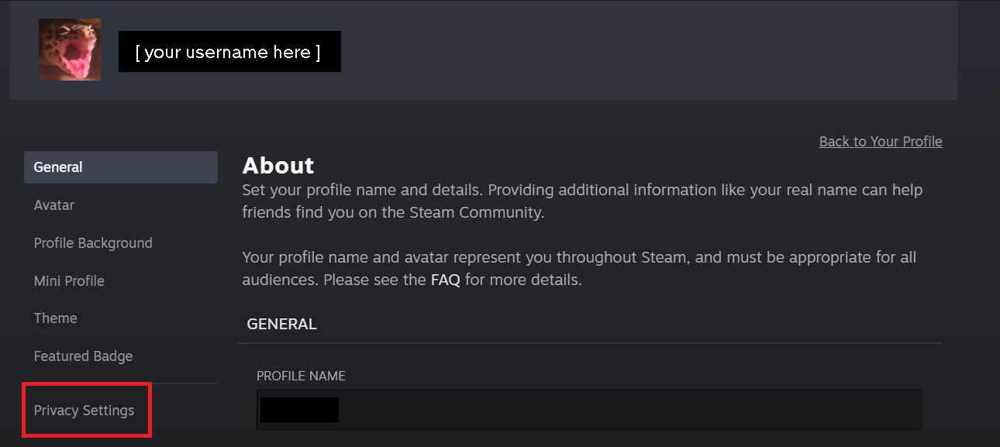
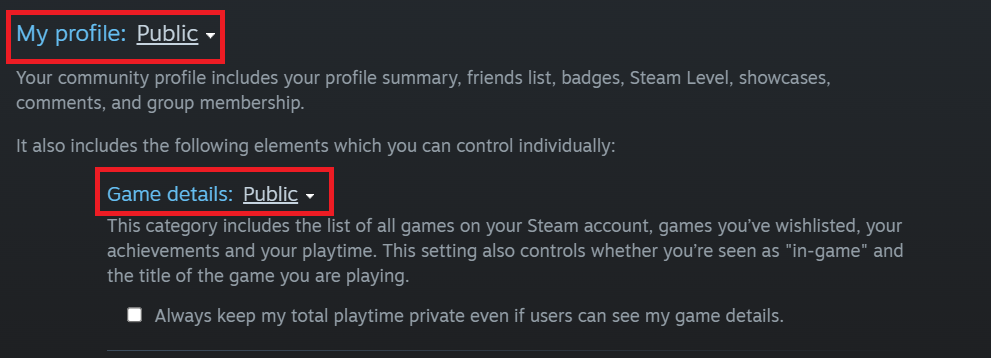

# Playground
A better recommendation system for gamers! Built by [Nick Carrino](https://github.com/Carrin0), [Victor Fawole](https://github.com/Sentiaus), [Luke Glaze](https://github.com/LukeGlaze), and [Ava Scherocman](https://github.com/avascherocman) for [CSE 5914: Knowledge-Based Systems Capstone](https://syllabi.engineering.osu.edu/syllabi/cse_5914) at the Ohio State University.

## Table of Contents
1. [Tech Stack](#Tech_Stack)
2. [Get Started](#Get_Started)
4. [Container Ports](#Ports)
4. [Adjust Steam Profile Settings](#Steam)


## Tech Stack <a id="Tech_Stack"></a>
* [Flask](https://flask.palletsprojects.com/en/stable/) for the backend
* [Vite](https://vite.dev/) and [Tailwind](https://tailwindcss.com/) for the front end
* [ElasticSearch](https://www.elastic.co/elasticsearch) for game data storage and game recommendations
* [PostgreSQL](https://www.postgresql.org/) for user profile data storage
* [Redis](https://redis.io/) for manual implementation of JSON web tokens (JWT) for authentication
* [Docker](https://www.docker.com/) for containerization
* The [IGDB API](https://api-docs.igdb.com/#getting-started) for game data
* The [Steam Web API](https://steamcommunity.com/dev) for Steam user data

## Get Started <a id="Get_Started"></a>
1. Install the necessary software:
    * [Git](https://git-scm.com/downloads) and [Git LFS](https://git-lfs.com/)
    * [Docker Desktop](https://docs.docker.com/get-started/introduction/get-docker-desktop/)
2. [Clone the repository](https://docs.github.com/en/repositories/creating-and-managing-repositories/cloning-a-repository) to your local machine
3. In the project directory, create a file named ```.env``` for storing secrets. Please contact the Playground team for the contents of this file.
4. In the project directory, run the command ```docker compose up``` to start the project containers.
5. Navigate to [http://localhost:5173](http://localhost:5173) to access the front end of the project.
6. To shut down the project containers, run ```docker compose down```.

## Container Ports<a id="Ports"></a>
* [5173](http://localhost:5173): Front end
* [5000](http://localhost:5000): Back end
* [9200](http://localhost:9200): ElasticSearch
* [5432](http://localhost:5432): PostgreSQL
* [5050](http://localhost:5050): pgAdmin
* [6379](http://localhost:6379): Redis

## Adjust Steam Profile Settings <a id="Steam"></a>
In order for Playground to grab played games from your Steam profile, you will need to have game details for your Steam account set to be publicly visible. <br>
1. On your Steam profile, click the "Edit Profile" button to the right of your username and profile picture:

2. Select the "Privacy Settings" menu option on the left side of the screen:

3. Ensure that both "My profile" and "Game details" are set to <b>Public</b>:

This may take some time to update in Steam's API in order to allow Playground to grab your played game information.